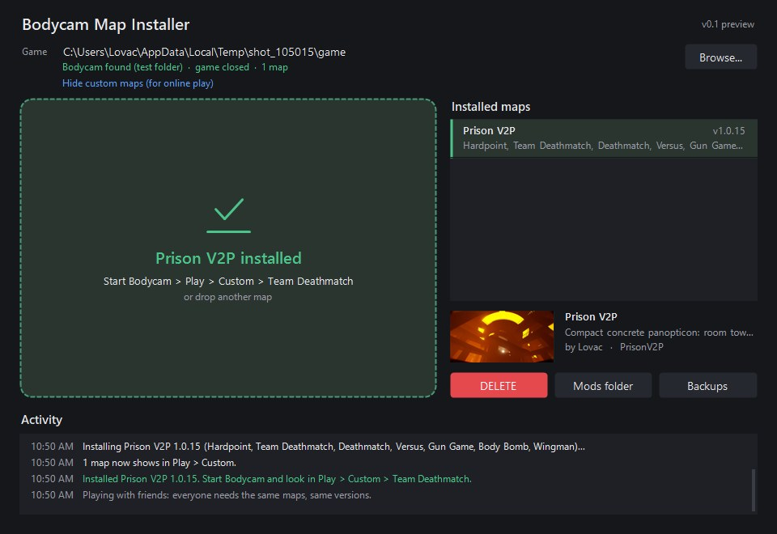
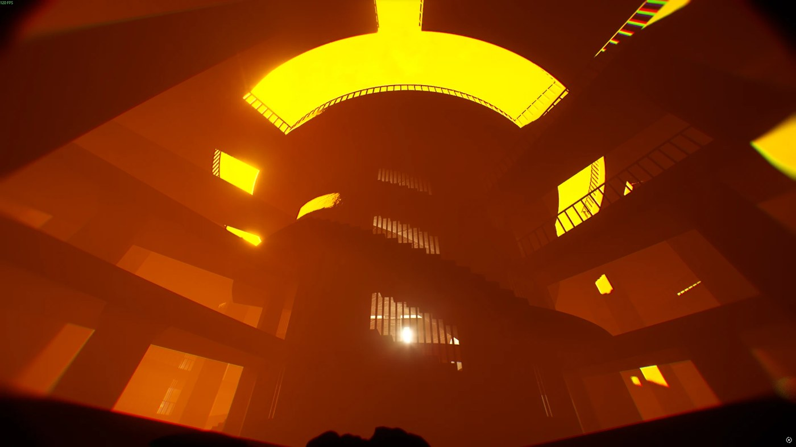
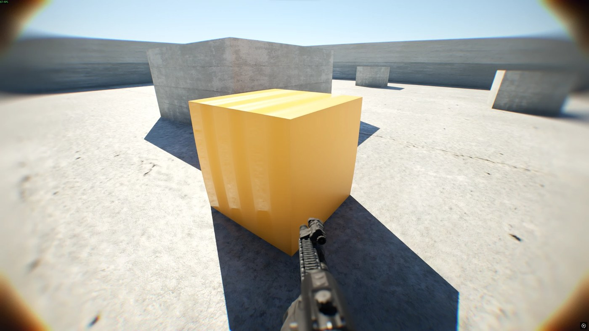
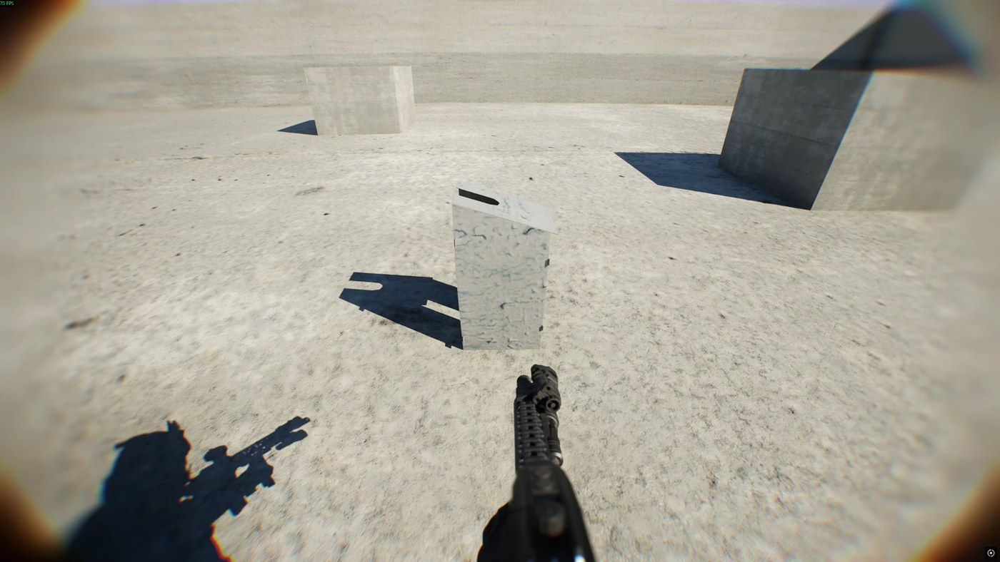
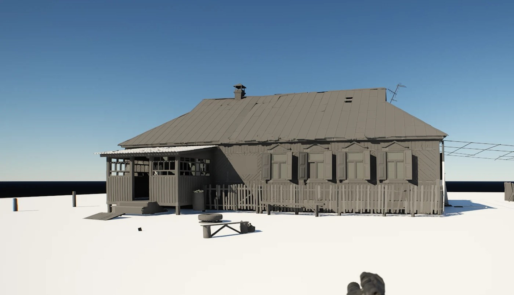
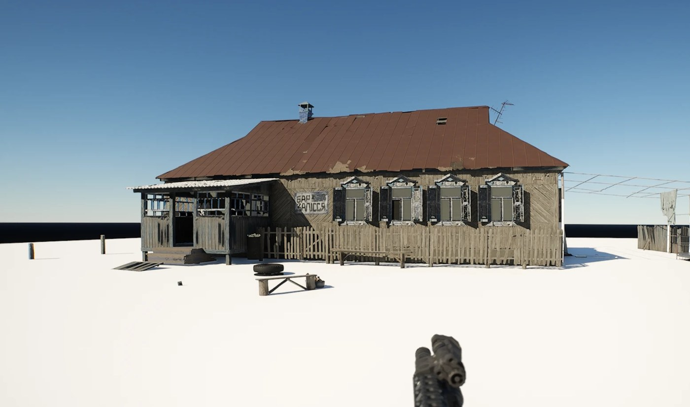
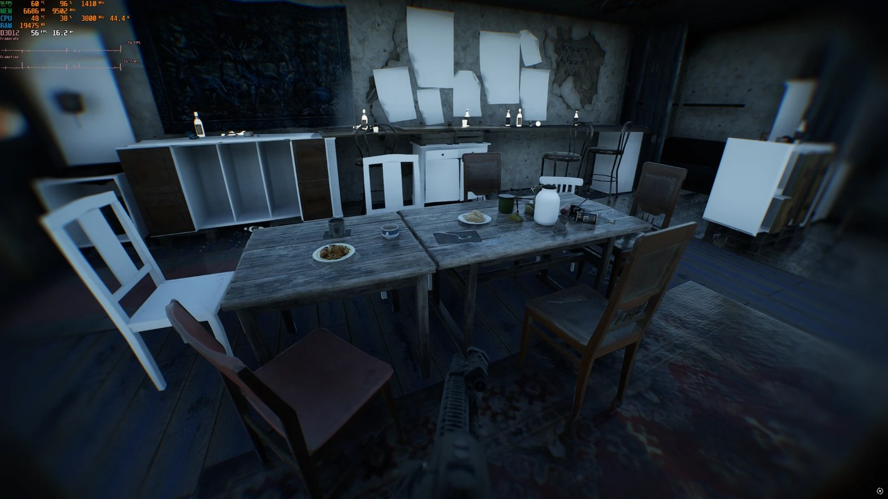

<p align="center"></p>

# Bodycam Map Importer

A free Windows app that adds **custom maps to Bodycam**. Drop a map on the window and it shows up as its own card in
**Play > Custom**, in every mode the map supports. No game map is replaced.

The window still says "Bodycam Map Installer". It is the same app.

Made by **Lovac** (Prison V2P and Prison V3XXL on Nexus Mods). Fan-made: not made, supported or endorsed by
Reissad Studio. Bodycam and its files belong to Reissad Studio. Use mods at your own risk.

<p align="center"></p>

## Download

Get **BodycamMapInstaller.exe** from the [Releases page](../../releases/latest). It is one file: no setup, no
internet, no admin rights needed.

## Install a map (players)

1. Close Bodycam.
2. Start `BodycamMapInstaller.exe`. It finds Bodycam through Steam by itself.
3. Drag the map you downloaded (`.bcmap`, `.zip` or `.pak`) onto the window.
4. Start Bodycam > **Play > Custom** > pick a mode > your map > host a **private** match and add bots.

To remove a map: select it in the list and click **DELETE**. Before playing online, click
**Hide custom maps (for online play)**; **Show custom maps again** brings them back.
Every file the app replaces or removes is moved to `Bodycam\Content\Paks\_backup\`, never deleted.

<p align="center"></p>

Custom maps are for **private matches with bots**. Everyone in a match needs the same maps and versions.

## Make your own map (map makers)

Maps are built in **Unreal Engine 5.5** with the **Bodycam Map Kit**: a ready Unreal project with the game's mode
templates, plus one command that checks your level, builds all 7 modes, bakes the bot navigation, makes the menu card
from your screenshot, cooks, packs and installs it.

> The Map Kit download is being cleaned for public release and will be linked here in the next days.

What you need:

| | |
|---|---|
| Bodycam | from Steam |
| Unreal Engine **5.5** | Epic Games Launcher > Unreal Engine > Library > + > **5.5** (not 5.6 or newer: the game will not load it) |
| Git for Windows | https://gitforwindows.org (default options). Gives "Git Bash", which runs the build. |
| Python 3 + Pillow | https://www.python.org (tick "Add python.exe to PATH"), then `py -m pip install Pillow` |

Steps:

1. **Test your PC first.** In Git Bash, in the kit folder:
   `bash Scripts/newmap.sh KitSample "Kit Sample" Sample/kit_sample_photo.png 0.1.0`
   When it says `DONE`, start Bodycam > Play > Custom > **Kit Sample**: an arena with an orange crate.
2. Open `BodycamSandbox.uproject` in Unreal 5.5. Make your level and save it as `Content/Sandbox/<Name>/<Name>_BP`
   (`<Name>` = 2-13 letters or digits, no spaces).
3. Put in the level: **PlayerStart** actors flat on the ground, tagged `1` or `2` for the two teams (6 per team is
   good); one **DirectionalLight** and one **SkyLight**; for Hardpoint, **1 HardPointZone** and **2-32
   BP_PointZonePreview** from `Content/GM/Gamemode/HardPoint`.
4. Keep everything your level uses inside `Content/Sandbox/<Name>/` (your meshes, materials, textures).
5. Save, close Unreal, and in Git Bash:
   `bash Scripts/newmap.sh <Name> "<Name players see>" <screenshot.png> 0.1.0`
6. Share the `.bcmap` it writes to `Saved/maps/<Name>/out/`. Players drop it on this app.

To update a map, run the same command with a higher version (0.1.1, 0.1.2 ...).

<p align="center"></p>

**Bought or downloaded assets work, with their own materials and shaders.** One rule from experience: in your own
materials, every texture parameter needs a default texture of the same kind (color on a color slot, normal map on a
normal slot, mask on a mask slot). Without one, the game cannot compile the material and draws it plain grey.

## Example: a level from another Unreal Engine 5 game (STALKER 2)

The kit can bring in levels from other UE5 games **you own**, for **your own private matches**. Do not publish maps
made from another game's assets: they belong to that game's studio, and Nexus Mods and most sites remove them.

This is how the Zalissya bar from STALKER 2 got into Bodycam, as a test:

1. **Get the game's mod kit or files.** STALKER 2 has an official free mod kit (the Zone Kit, on the Epic Games
   Launcher). Its levels, meshes and textures are normal Unreal assets.
2. **Cut the area you want.** Pick one building or block (we took the bar plus 3 m around it: 4,056 placed objects,
   729 different meshes). Smaller is better: every mesh costs memory and loading time.
3. **Export meshes and textures** with a pak exporter such as FModel (glTF for meshes, PNG for textures).
4. **Import into the kit project** under `Content/Sandbox/<Name>/`, then place every object where the original level
   had it (same position, rotation and scale).
5. **Rebuild the materials.** The other game's shaders do not come along. Make a few simple master materials (opaque,
   masked, glass) and one material instance per original material with its textures, tint and roughness. Give every
   texture parameter a default texture, or it shows grey.
6. **Make it playable.** Add a ground, team spawns, a hardpoint zone and previews, and remove door leaves that block
   doorways (Bodycam players are wider than STALKER's).
7. **Build it** with `newmap.sh` like any other map, and drop the `.bcmap` on the app.

First test, two props (a fence block and a gas box) in a Bodycam arena:

<p align="center"></p>

The bar, first build: meshes in place, materials not yet rebuilt (the game's grey default):

<p align="center"></p>

Same bar after the material rebuild:

<p align="center"></p>

Inside, walkable, in a Bodycam match:

<p align="center"></p>

These STALKER 2 tests were never published and never will be.

## How long this took

Work on Bodycam maps started in early **September 2026**. The app was written in mid-September, the first map
(Prison V2P) went up on Nexus Mods on **30 September**, the map kit passed its first full test on **2 October**, and
the STALKER 2 tests ran on **2-3 October**. About a month, over 130 work sessions. The tools were written with AI
assistance (Claude, by Anthropic).

## What the app does not do

- **No internet.** No network calls, no update check, no telemetry.
- **No admin rights at start** (`App/app.manifest` asks for `asInvoker`). If Windows refuses a write in the game
  folder, it offers a "Run as administrator" button; nothing happens unless you click it.
- **No deleting.** Replaced or removed files go to the backup folder.
- **No changes to the game's own files.** It never writes `pakchunk*-Windows.pak` and refuses a map that would
  replace a Bodycam file.
- **Nothing while Bodycam is running.** It checks first and stops.

`SECURITY.md` lists every place the app writes.

## Build it yourself

The exe also carries 16 small files from Bodycam (the game's map-list and weather tables, about 25 KB) that it needs
to rebuild the shared menu file. They are **not** in this repository; their names, sizes and hashes are in
`Core/BaseTables.cs`. To build:

1. Install the .NET SDK **8.0.422** (https://dotnet.microsoft.com/download/dotnet/8.0).
2. Copy the tables out of the downloaded exe (this reads it as data, it does not run it), in Windows PowerShell in
   this folder:

   ```powershell
   $exe = 'C:\Downloads\BodycamMapInstaller.exe'
   $asm = [Reflection.Assembly]::ReflectionOnlyLoadFrom($exe)
   foreach ($name in $asm.GetManifestResourceNames()) {
     if ($name -notlike 'BaseTables/*') { continue }
     $dest = Join-Path (Get-Location) ('Core\' + $name.Replace('/', '\'))
     New-Item -ItemType Directory -Force (Split-Path $dest) | Out-Null
     $in = $asm.GetManifestResourceStream($name); $file = [IO.File]::Create($dest)
     $in.CopyTo($file); $file.Close(); $in.Close()
   }
   ```

3. `dotnet build App\BodycamMapInstaller.csproj -c Release`

The build is reproducible: with SDK 8.0.422 you get the same exe, byte for byte. Version 0.1.0 (5 October 2026):

| File | SHA-256 |
|---|---|
| `BodycamMapInstaller.exe` | `9a181d3decf17868bbaae61719993fcdd0cdd285e7873c6077b3bbac9eb640b2` |
| `BodycamMapInstaller.exe.config` | `051099983b896673909e01a1f631b6652abb88da95c9f06f3efef4be033091fa` |

## License

MIT, see `LICENSE`. The Bodycam tables inside the exe are not covered by it: they belong to Reissad Studio.
